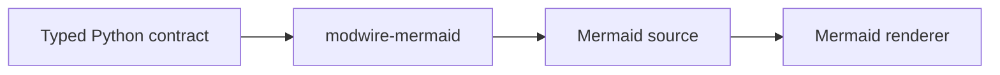

# modwire-mermaid

Build [Mermaid](https://mermaid.js.org/) diagrams from typed, immutable Python objects.
`modwire-mermaid` validates a diagram's structure and compiles it to deterministic Mermaid text
behind one class-based API. It performs no filesystem, browser, CLI, or image-rendering work.

Compilation is package-native. It does not depend on Node.js or `mermaid-py`; consumers may pass the
generated source to their preferred Mermaid renderer or validation binary.

## What is Mermaid?

Mermaid is a text-based diagramming language. A short definition such as:



can be rendered as a diagram by Mermaid-aware tools. Because the source is plain text, diagrams are
easy to review in version control, generate in tests, embed in Markdown, and render independently in
a browser or CI pipeline.

This package owns the first two steps: typed Python contracts and Mermaid source generation. Mermaid
itself—or a service or application that embeds it—owns visual rendering.

## Installation

`modwire-mermaid` requires Python 3.12 or newer.

```bash
pip install modwire-mermaid
```

## Quick start

Create a diagram with one of the feature builders, then compile it with the standard façade:

```python
from modwire_mermaid import ModwireMermaidFactory
from modwire_mermaid.timeline.diagram import ModwireTimelineBuilder

diagram = (
    ModwireTimelineBuilder.create("Release history")
    .section("2026")
    .period("Q1", "Private beta")
    .period("Q2", "Public release", "Documentation")
    .build()
)

source = ModwireMermaidFactory.standard().compile(diagram)
print(source)
```

The result is plain Mermaid source:

```text
---
config:
  timeline:
    disableMulticolor: false
---
timeline LR
  title Release history
  section 2026
    Q1 : Private beta
    Q2 : Public release : Documentation
```

Put the result inside a fenced `mermaid` block in supported Markdown, send it to the
[Mermaid Live Editor](https://mermaid.live/), or pass it to the renderer used by your application.
Rendering is deliberately outside this package, so server-side code can generate diagrams without
shipping a browser or Node.js runtime.

<!-- generated:public-api:start -->
## Public API

The supported root imports below are generated from `modwire_mermaid.__all__`.

| Symbol | Purpose | Primary API |
| --- | --- | --- |
| `ModwireDiagramError` | Report an invalid diagram contract or unsupported diagram operation. | — |
| `ModwireMermaid` | Compile validated Modwire diagram contracts into deterministic Mermaid source. | `compile(diagram: modwire_mermaid.contracts.ModwireBaseDiagram) -> str` |
| `ModwireMermaidFactory` | Build the standard Mermaid façade with every bundled diagram compiler. | `standard() -> modwire_mermaid.facade.ModwireMermaid` |
| `__version__` | Installed distribution version. | — |

## Executable example

Source: [`compile_timeline.py`](examples/compile_timeline.py). This file is executed by the test suite.

```python
from modwire_mermaid import ModwireMermaidFactory
from modwire_mermaid.timeline.diagram import ModwireTimelineBuilder

diagram = (
    ModwireTimelineBuilder.create("Release history")
    .section("2026")
    .period("Q1", "Private beta")
    .period("Q2", "Public release", "Documentation")
    .build()
)

source = ModwireMermaidFactory.standard().compile(diagram)
```
<!-- generated:public-api:end -->

## Diagrams

- [Architecture](docs/architecture/README.md)
- [Class diagram](docs/class-diagram/README.md)
- [Event modeling](docs/event-modeling/README.md)
- [File tree](docs/file-tree/README.md)
- [Flowchart](docs/flowchart/README.md)
- [Mindmap](docs/mindmap/README.md)
- [Sequence diagram](docs/sequence/README.md)
- [State diagram](docs/state/README.md)
- [Swimlanes](docs/swimlanes/README.md)
- [Timeline](docs/timeline/README.md)
- [User journey](docs/user-journey/README.md)

All contracts inherit `ModwireBaseDiagram`. It enforces required children, unique child identities,
and valid references consistently. Empty strings and tuples explicitly represent Mermaid features
that are absent; public contracts are non-nullable and have no implicit defaults.

## Design guarantees and scope

- Typed, frozen Pydantic contracts reject invalid diagram structure before compilation.
- Identical contracts produce identical Mermaid text, making snapshot tests and source diffs stable.
- The standard factory supports every diagram type listed above through one `compile()` method.
- The package generates text only; it does not render SVG/PNG, invoke Mermaid CLI, or write files.
- Mermaid parser and renderer compatibility must be checked by the consuming application.

## Development and release

Run `uv sync --all-groups` and `make verify`. Releases use strict SemVer tags and PyPI Trusted
Publishing configured for repository `9orky/modwire-mermaid`, workflow `release.yml`, and environment
`pypi`.
