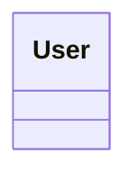
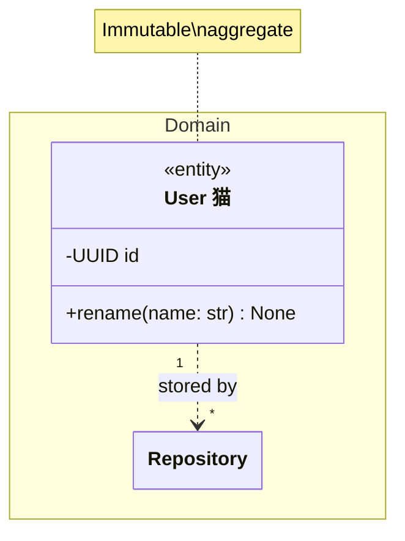

# class compatibility

This file is generated by `scripts/generate_compatibility.py`; do not edit it manually.
Upstream syntax: [https://mermaid.js.org/syntax/classDiagram.html](https://mermaid.js.org/syntax/classDiagram.html).
The fixtures are built with strict frozen Pydantic contracts and compiled through `ModwireMermaidFactory.standard()`.

## Feature inventory

| Feature | Status | Contract | Evidence |
| --- | --- | --- | --- |
| `classes-members-generics-annotations` | supported | Emitted by the typed model and exercised by the corpus. | `class.comprehensive` |
| `namespaces-relationships-notes` | supported | Emitted by the typed model and exercised by the corpus. | `class.comprehensive` |
| `interactions-styles-configuration` | supported | Emitted by the typed model and exercised by the corpus. | `class.comprehensive` |
| `alternate-member-authoring` | unsupported | One canonical typed authoring form is emitted. | — |

## Executable fixtures

### `class.minimal`

Snapshot: [`class.minimal.mmd`](../../compatibility/snapshots/source/class.minimal.mmd).

### `class.comprehensive`

Snapshot: [`class.comprehensive.mmd`](../../compatibility/snapshots/source/class.comprehensive.mmd).

