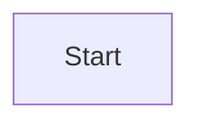
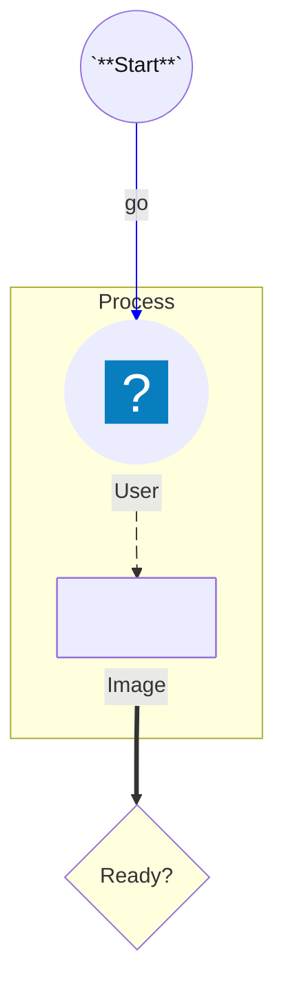

# flowchart compatibility

This file is generated by `scripts/generate_compatibility.py`; do not edit it manually.
Upstream syntax: [https://mermaid.js.org/syntax/flowchart.html](https://mermaid.js.org/syntax/flowchart.html).
The fixtures are built with strict frozen Pydantic contracts and compiled through `ModwireMermaidFactory.standard()`.

## Feature inventory

| Feature | Status | Contract | Evidence |
| --- | --- | --- | --- |
| `nodes-shapes-icons-images-markdown` | supported | Emitted by the typed model and exercised by the corpus. | `flowchart.comprehensive` |
| `edges-animation-curves-subgraphs-interactions-styles` | supported | Emitted by the typed model and exercised by the corpus. | `flowchart.comprehensive` |
| `diagram-configuration` | partial | Typed direction and curves exist; arbitrary init config does not. | — |
| `accessibility` | unsupported | Flowchart accessibility directives are not exposed. | — |
| `alternate-link-authoring` | unsupported | One canonical typed edge form is emitted. | — |

## Executable fixtures

### `flowchart.minimal`

Snapshot: [`flowchart.minimal.mmd`](../../compatibility/snapshots/source/flowchart.minimal.mmd).

### `flowchart.comprehensive`

Snapshot: [`flowchart.comprehensive.mmd`](../../compatibility/snapshots/source/flowchart.comprehensive.mmd).

