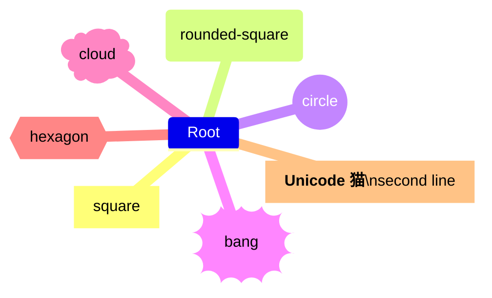

# mindmap compatibility

This file is generated by `scripts/generate_compatibility.py`; do not edit it manually.
Upstream syntax: [https://mermaid.js.org/syntax/mindmap.html](https://mermaid.js.org/syntax/mindmap.html).
The fixtures are built with strict frozen Pydantic contracts and compiled through `ModwireMermaidFactory.standard()`.

## Feature inventory

| Feature | Status | Contract | Evidence |
| --- | --- | --- | --- |
| `shapes-markdown-icons-classes-layout` | supported | Emitted by the typed model and exercised by the corpus. | `mindmap.comprehensive` |
| `recursive-unicode-content` | supported | Emitted by the typed model and exercised by the corpus. | `mindmap.focused-recursive-unicode` |

## Executable fixtures

### `mindmap.minimal`

Snapshot: [`mindmap.minimal.mmd`](../../compatibility/snapshots/source/mindmap.minimal.mmd).

### `mindmap.comprehensive`

Snapshot: [`mindmap.comprehensive.mmd`](../../compatibility/snapshots/source/mindmap.comprehensive.mmd).

### `mindmap.focused-recursive-unicode`

Snapshot: [`mindmap.focused-recursive-unicode.mmd`](../../compatibility/snapshots/source/mindmap.focused-recursive-unicode.mmd).

