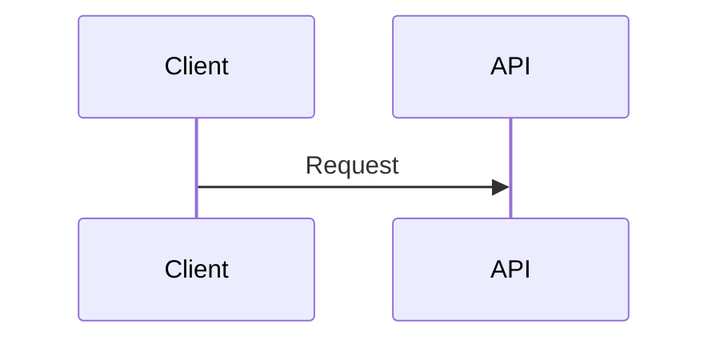
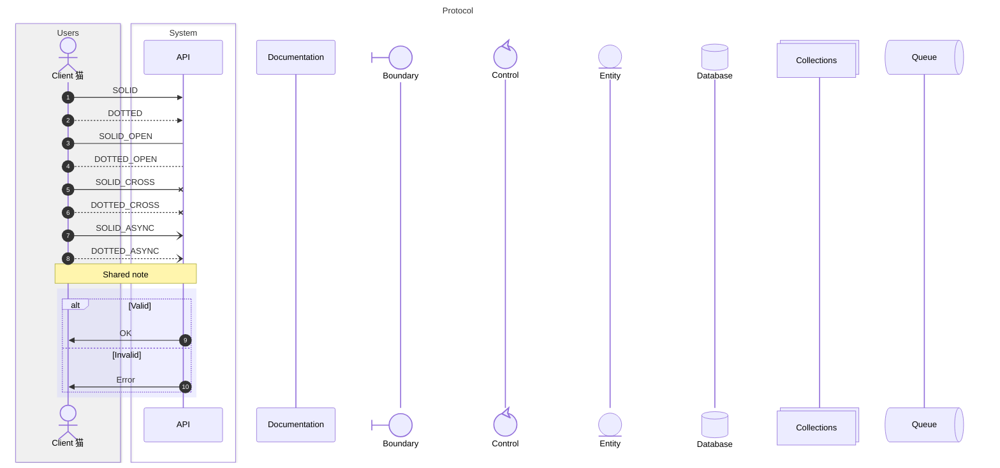

# sequence compatibility

This file is generated by `scripts/generate_compatibility.py`; do not edit it manually.
Upstream syntax: [https://mermaid.js.org/syntax/sequenceDiagram.html](https://mermaid.js.org/syntax/sequenceDiagram.html).
The fixtures are built with strict frozen Pydantic contracts and compiled through `ModwireMermaidFactory.standard()`.

## Feature inventory

| Feature | Status | Contract | Evidence |
| --- | --- | --- | --- |
| `participants-messages-arrow-types` | supported | Emitted by the typed model and exercised by the corpus. | `sequence.minimal`, `sequence.comprehensive` |
| `activation-lifecycle-notes-links-boxes-rects-blocks` | supported | Emitted by the typed model and exercised by the corpus. | `sequence.comprehensive` |
| `boolean-autonumber` | supported | Emitted by the typed model and exercised by the corpus. | `sequence.comprehensive` |
| `autonumber-start-and-increment` | unsupported | Only the boolean autonumber directive is modeled. | — |

## Executable fixtures

### `sequence.minimal`

Snapshot: [`sequence.minimal.mmd`](../../compatibility/snapshots/source/sequence.minimal.mmd).

### `sequence.comprehensive`

Snapshot: [`sequence.comprehensive.mmd`](../../compatibility/snapshots/source/sequence.comprehensive.mmd).

