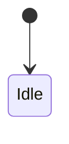
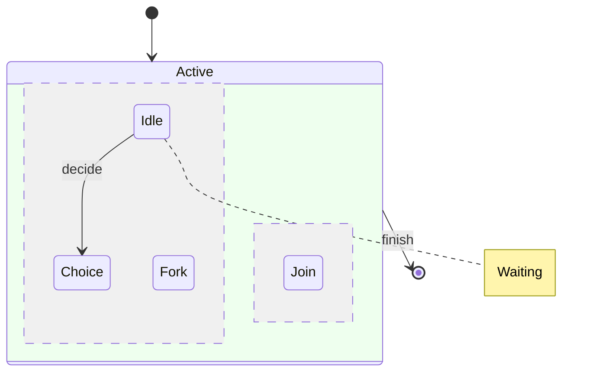

# state compatibility

This file is generated by `scripts/generate_compatibility.py`; do not edit it manually.
Upstream syntax: [https://mermaid.js.org/syntax/stateDiagram.html](https://mermaid.js.org/syntax/stateDiagram.html).
The fixtures are built with strict frozen Pydantic contracts and compiled through `ModwireMermaidFactory.standard()`.

## Feature inventory

| Feature | Status | Contract | Evidence |
| --- | --- | --- | --- |
| `states-transitions-start-end` | supported | Emitted by the typed model and exercised by the corpus. | `state.minimal`, `state.comprehensive` |
| `choice-fork-join-composites-concurrency-direction` | supported | Emitted by the typed model and exercised by the corpus. | `state.comprehensive` |
| `notes-styles-accessibility` | supported | Emitted by the typed model and exercised by the corpus. | `state.comprehensive` |

## Executable fixtures

### `state.minimal`

Snapshot: [`state.minimal.mmd`](../../compatibility/snapshots/source/state.minimal.mmd).

### `state.comprehensive`

Snapshot: [`state.comprehensive.mmd`](../../compatibility/snapshots/source/state.comprehensive.mmd).

