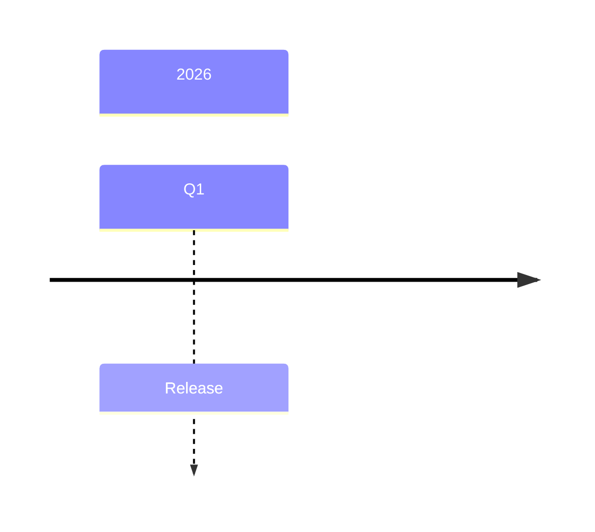
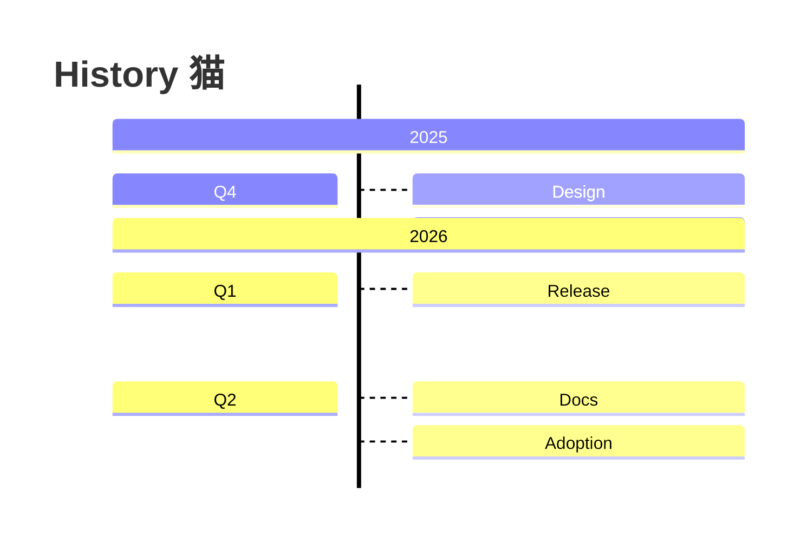

# timeline compatibility

This file is generated by `scripts/generate_compatibility.py`; do not edit it manually.
Upstream syntax: [https://mermaid.js.org/syntax/timeline.html](https://mermaid.js.org/syntax/timeline.html).
The fixtures are built with strict frozen Pydantic contracts and compiled through `ModwireMermaidFactory.standard()`.

## Feature inventory

| Feature | Status | Contract | Evidence |
| --- | --- | --- | --- |
| `title-sections-periods-events` | supported | Emitted by the typed model and exercised by the corpus. | `timeline.minimal`, `timeline.comprehensive` |
| `directions-and-configuration` | supported | Emitted by the typed model and exercised by the corpus. | `timeline.comprehensive` |

## Executable fixtures

### `timeline.minimal`

Snapshot: [`timeline.minimal.mmd`](../../compatibility/snapshots/source/timeline.minimal.mmd).

### `timeline.comprehensive`

Snapshot: [`timeline.comprehensive.mmd`](../../compatibility/snapshots/source/timeline.comprehensive.mmd).

