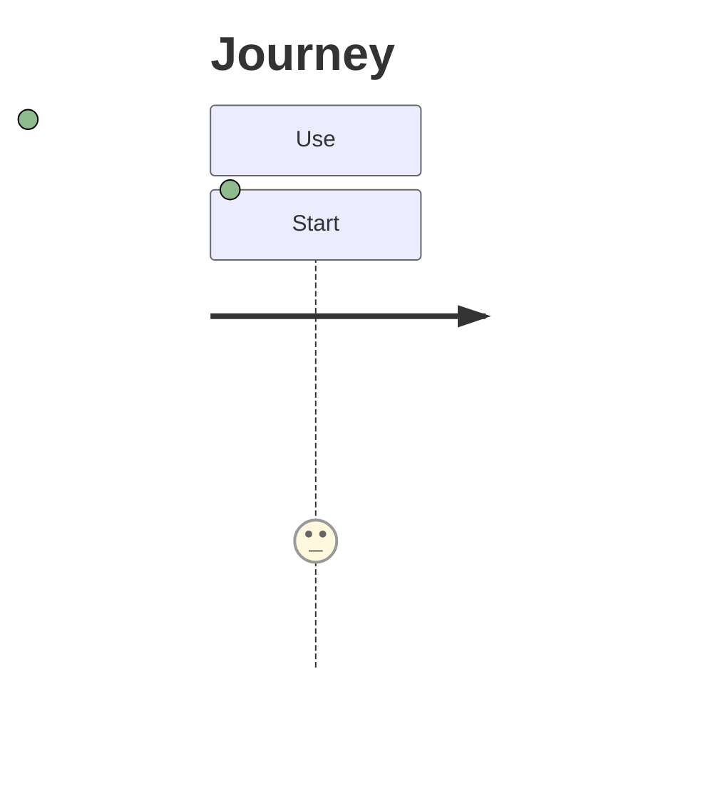
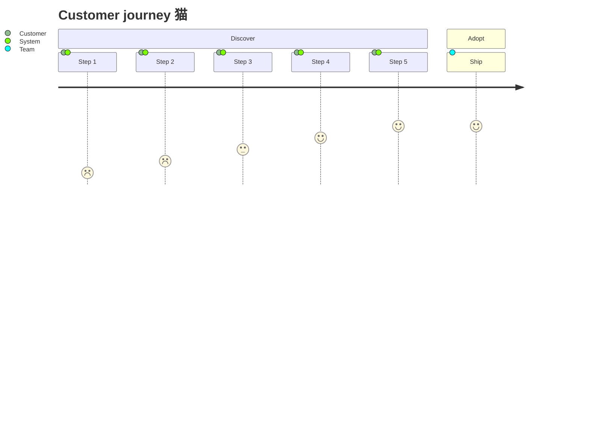

# user-journey compatibility

This file is generated by `scripts/generate_compatibility.py`; do not edit it manually.
Upstream syntax: [https://mermaid.js.org/syntax/userJourney.html](https://mermaid.js.org/syntax/userJourney.html).
The fixtures are built with strict frozen Pydantic contracts and compiled through `ModwireMermaidFactory.standard()`.

## Feature inventory

| Feature | Status | Contract | Evidence |
| --- | --- | --- | --- |
| `sections-tasks-scores-actors` | supported | Emitted by the typed model and exercised by the corpus. | `user-journey.minimal`, `user-journey.comprehensive` |

## Executable fixtures

### `user-journey.minimal`

Snapshot: [`user-journey.minimal.mmd`](../../compatibility/snapshots/source/user-journey.minimal.mmd).

### `user-journey.comprehensive`

Snapshot: [`user-journey.comprehensive.mmd`](../../compatibility/snapshots/source/user-journey.comprehensive.mmd).

